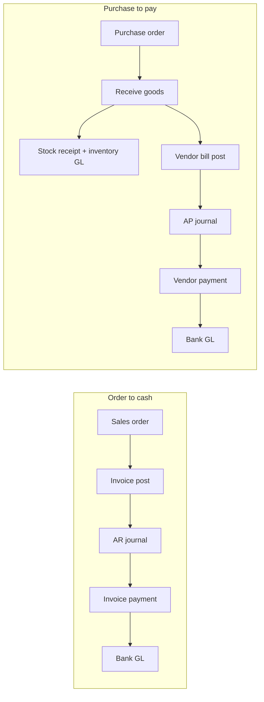

# Accounting, Inventory & Procurement — Implementation Guide

This document describes the **implemented** accounting and inventory capabilities delivered in migrations `1768700000000` through `1769300000000` (Phases 5–10), plus supporting features from earlier migrations.

**Audience:** Developers, accountants, implementers  
**Last updated:** May 15, 2026

See also: [RBAC & permissions](./RBAC-AND-PERMISSIONS.md) | [Workflows index](../backend/docs/WORKFLOWS-INDEX.md)

---

## Table of contents

1. [Overview](#overview)
2. [Prerequisites & configuration](#prerequisites--configuration)
3. [Inventory valuation (foundation)](#inventory-valuation-foundation)
4. [Phase 5 — Journal traceability & period close](#phase-5--journal-traceability--period-close)
5. [Phase 6 — Procurement reconciliation](#phase-6--procurement-reconciliation)
6. [Phase 7 — Category COGS & inventory GL](#phase-7--category-cogs--inventory-gl)
7. [Phase 8 — Vendor (AP) payments](#phase-8--vendor-ap-payments)
8. [Phase 9 — Invoice (AR) payments & PPV](#phase-9--invoice-ar-payments--ppv)
9. [Phase 10 — AR/AP GL reconciliation](#phase-10--arap-gl-reconciliation)
10. [API reference](#api-reference)
11. [GL journal source types](#gl-journal-source-types)
12. [Frontend surfaces](#frontend-surfaces)
13. [Troubleshooting](#troubleshooting)
14. [Future work](#future-work)

---

## Overview

### Capability matrix

| Phase | Migration | Capability |
| ----- | --------- | ---------- |
| Foundation | `1768700000000` | Costing methods (FIFO, LIFO, AVERAGE, STANDARD), perpetual/periodic settings |
| Foundation | `1768011000000` | Posting account mappings (AR, AP, revenue, bank, etc.) — [setup guide](./POSTING-ACCOUNT-MAPPINGS-SETUP.md) |
| Foundation | `1768011000001` | Product category → revenue/AR overrides |
| **5** | `1768900000000` | Journal `source_type` / `source_id`, inventory period close reversal, opening snapshots |
| **6** | `1769000000000` | PO receive tracking, 3-way match, GRNI, bill from PO |
| **7** | `1769100000000` | Category COGS & inventory GL accounts, inventory/COGS GL reconciliation reports |
| **8** | `1769200000000` | Vendor bill payments with GL |
| **9** | `1769300000000` | Invoice payments with GL, PPV on standard-cost receipts |
| **10** | (no migration) | AR/AP subledger vs control-account GL reconciliation; smarter AR payment allocation |

### End-to-end flows



---

## Prerequisites & configuration

Before using posting features, configure per tenant (and optionally per branch):

### 1. Posting account mappings

**API:** `GET/POST/PUT /finance/config/posting-account-mappings`  
**Setup guide:** [Posting Account Mappings — Setup Guide](./POSTING-ACCOUNT-MAPPINGS-SETUP.md) (bilingual COA examples, completeness checklist, step-by-step)

| Field | Purpose |
| ----- | ------- |
| `defaultArAccountId` | Accounts receivable control (**required** on create) |
| `defaultSalesRevenueAccountId` | Sales revenue fallback (**required** on create) |
| `defaultOutputVatAccountId` | Output VAT on sales invoices (**required** on create) |
| `defaultApAccountId` | Accounts payable control |
| `defaultPaymentAccountId` | Bank/cash for **both** AR receipts and AP disbursements |
| `defaultPurchasesAccountId` | Purchases / clearing |
| `defaultInputVatAccountId` | Input VAT on vendor bills |
| `defaultGrniAccountId` | Goods received not invoiced |
| `defaultPpvAccountId` | Purchase price variance (standard costing) |
| `defaultInventoryAccountId` | Inventory asset (required for perpetual GL) |
| `defaultCogsAccountId` | COGS (required for perpetual GL) |
| `defaultRealizedFxGainAccountId` / `defaultRealizedFxLossAccountId` | FX on payments |
| `defaultUnrealizedFxGainAccountId` / `defaultUnrealizedFxLossAccountId` | Month-end revaluation |
| `defaultVatRatePercent` | Default VAT % on invoice/bill lines (default 14) |
| `branchId` | Optional branch override; omit for tenant default |

**Service:** `resolve-posting-mapping.ts` — resolves branch-specific mapping or tenant default.

### 2. Product category account mappings

**API:** `GET/POST/PUT /finance/config/product-category-account-mappings`

Overrides per category:

- `revenueAccountId`, `arAccountId`
- `cogsAccountId`, `inventoryAccountId` (Phase 7)

Used when posting invoices, stock movements, and allocating AR payments by line category.

### 3. Fiscal periods

Payments and automated journals require an **open** fiscal period covering the transaction date.

### 4. Inventory settings

**API:** `GET/PUT /inventory/settings`

- `inventoryMethod`: `PERPETUAL` | `PERIODIC`
- Default costing method for new products
- Standard cost maintenance UI on product valuation

---

## Inventory valuation (foundation)

**Migration:** `1768700000000-add-inventory-valuation-and-settings.ts`

### Costing methods

| Method | Behavior |
| ------ | -------- |
| `FIFO` | First-in layers consumed on issue |
| `LIFO` | Last-in layers consumed on issue |
| `AVERAGE` | Weighted average unit cost |
| `STANDARD` | Fixed standard cost; **PPV** on receipt when actual ≠ standard |

### Key services

| Service | Role |
| ------- | ---- |
| `inventory-posting.service.ts` | Posts receipt/issue journals, PPV lines |
| `inventory-valuation.service.ts` | Layer tracking, unit cost |
| `valuation-unit-cost.ts` | Report/preview unit costs |

### Reports

| Endpoint | Description |
| -------- | ------------- |
| `GET /inventory/reports/valuation` | On-hand value by product/location |
| `GET /inventory/reports/stock-ledger` | Quantity movements |
| `GET /inventory/reports/cogs-by-period` | COGS by period |
| `GET /inventory/reports/cogs-by-category` | COGS by product category |
| `GET /inventory/reports/gl-reconciliation/inventory` | Subledger vs GL inventory accounts |
| `GET /inventory/reports/gl-reconciliation/cogs` | Subledger vs GL COGS accounts |

---

## Phase 5 — Journal traceability & period close

**Migration:** `1768900000000-phase5-journal-source-and-period-close.ts`

### Journal source linkage

`journal_entries` gains:

- `source_type` — see [GL journal source types](#gl-journal-source-types)
- `source_id` — UUID of originating document (invoice, payment, receipt, etc.)

Enables:

- Idempotent reposting checks (same reference + source)
- AR payment allocation from original invoice journal (Phase 10)

### Inventory period close

- Status enum extended with `REVERSED`
- `reversal_journal_reference`, `reversed_at` on `inventory_period_closes`
- `inventory_opening_snapshots` — opening inventory value per `as_of_date`

**API:** `GET/POST /inventory/period-closes`, `GET /inventory/opening-snapshots`

---

## Phase 6 — Procurement reconciliation

**Migration:** `1769000000000-phase6-procurement-reconciliation.ts`

### Schema changes

- `purchase_order_lines.qty_received`, `qty_billed`
- `stock_receipts.purchase_order_id`
- `stock_receipt_lines.purchase_order_line_id`
- `vendor_bill_lines.purchase_order_line_id`

### Workflow

1. **Create RFQ/PO** — `POST /procurement/rfq` → confirm → `POST /procurement/orders/:id/confirm`
2. **Receive** — `POST /procurement/orders/:id/receive` creates stock receipt, updates `qty_received`
3. **Reconciliation view** — `GET /procurement/orders/:id/reconciliation`
4. **Create bill from PO** — `POST /procurement/orders/:id/bill`
5. **3-way match preview** — `GET /procurement/bills/:id/match-preview` (before post)
6. **Post bill** — `POST /procurement/bills/:id/post` → AP + GRNI/expense GL

### Permissions

- `confirm:purchase_order` — confirm PO, receive goods
- `create:vendor_bill` — create bill from PO

---

## Phase 7 — Category COGS & inventory GL

**Migration:** `1769100000000-phase7-category-cogs-gl-reconciliation.ts`

Adds `cogs_account_id` and `inventory_account_id` to `product_category_account_mappings`.

Stock receipts and issues post to category-specific inventory/COGS accounts when configured; otherwise posting mapping defaults apply.

### GL reconciliation reports (inventory module)

Compare summed inventory subledger balances to posted GL balances on mapped accounts. Use to detect mis-postings or missing category mappings.

---

## Phase 8 — Vendor (AP) payments

**Migration:** `1769200000000-phase8-vendor-payments.ts`

### Table: `vendor_payments`

| Column | Description |
| ------ | ----------- |
| `vendor_bill_id` | Bill being paid |
| `payment_date` | Payment date |
| `amount` | Payment amount |
| `payment_account_id` | Bank/cash GL account |
| `reference`, `notes` | Optional |
| `journal_reference` | e.g. `VB-PAY-{billNumber}-1` |

### API

```
GET  /procurement/bills/:id/payments
POST /procurement/bills/:id/payments
```

**Permission:** `pay:vendor_bill`

**DTO:** `RecordVendorPaymentDto` — `amount`, optional `paymentDate`, `paymentAccountId`, `reference`, `notes`

### GL entry (posted)

```
Debit:  Accounts Payable     (total payment)
Credit: Bank/Cash account    (total payment)
```

**Journal source:** `VENDOR_PAYMENT`

### Rules

- Bill must be `POSTED`
- Payment amount ≤ balance due
- Fiscal period open for payment date
- `defaultApAccountId` and payment account required on posting mapping

---

## Phase 9 — Invoice (AR) payments & PPV

**Migration:** `1769300000000-phase9-invoice-payments-ppv.ts`

### Table: `invoice_payments`

Same shape as vendor payments, linked to `invoices`.

### API

```
GET  /sales/invoices/:id/payments
POST /sales/invoices/:id/payments
```

**Permission:** `pay:invoice`

**DTO:** `RecordInvoicePaymentDto`

```json
{
  "amount": 1000.0,
  "paymentDate": "2025-05-15",
  "paymentAccountId": "uuid-optional",
  "reference": "CHK-1001",
  "notes": "optional"
}
```

### GL entry (posted)

```
Debit:  Bank/Cash              (payment amount)
Credit: Accounts Receivable    (split across AR accounts — see Phase 10)
```

**Journal source:** `INVOICE_PAYMENT`

### Invoice status

- Payments allowed when invoice status is `SENT` (posted)
- `amountPaid` accumulates; status → `PAID` when fully paid
- Commission accrual runs on full payment (non-blocking)

### Purchase price variance (PPV)

On **standard-cost** stock receipts, when actual unit cost ≠ standard:

- Inventory debited at standard
- PPV account debited/credited for variance
- Requires `defaultPpvAccountId` on posting mapping

**Service:** `inventory-posting.service.ts` (receipt completion path)

---

## Phase 10 — AR/AP GL reconciliation

**No new migration.** Adds reporting and smarter payment posting.

### AR/AP reconciliation API

```
GET /finance/reports/gl-reconciliation/ar?asOfDate=YYYY-MM-DD&branchId=optional
GET /finance/reports/gl-reconciliation/ap?asOfDate=YYYY-MM-DD&branchId=optional
```

**Response:** `ControlAccountGlReconciliationDto`

| Field | Meaning |
| ----- | ------- |
| `subledgerBalance` | Sum of open invoice/bill balances |
| `glBalance` | Sum of GL control account balances (posted journals, as of date) |
| `difference` | `subledgerBalance - glBalance` |
| `isReconciled` | `|difference| < 0.02` |

AR includes category-mapped AR accounts plus default AR from posting mapping.

### Smarter AR payment allocation

**Utility:** `allocate-ar-payment-lines.ts`

1. Find posted invoice journal (`source_type = INVOICE`, `source_id = invoice.id`)
2. Split payment credits across same AR accounts proportionally to original debits
3. Fallback: allocate by invoice line product category → `arAccountId`
4. Final fallback: `defaultArAccountId`

Ensures payment journals mirror revenue recognition structure for multi-account AR.

### Vendor payments

Branch-aware posting mapping via `resolve-posting-mapping.ts` (same as AR).

---

## API reference

### Sales

| Method | Path | Permission | Description |
| ------ | ---- | ---------- | ----------- |
| POST | `/sales/invoices/:id/post` | `post:invoice` | Post invoice → AR + revenue (+ COGS if issued) |
| GET | `/sales/invoices/:id/payments` | `read:invoice` | List payments |
| POST | `/sales/invoices/:id/payments` | `pay:invoice` | Record payment + GL |
| GET | `/sales/invoices/:id/cogs-preview` | `read:invoice` | COGS preview before post |

### Procurement

| Method | Path | Permission | Description |
| ------ | ---- | ---------- | ----------- |
| POST | `/procurement/orders/:id/confirm` | `confirm:purchase_order` | Confirm PO |
| POST | `/procurement/orders/:id/receive` | `confirm:purchase_order` | Receive stock |
| POST | `/procurement/orders/:id/bill` | `create:vendor_bill` | Create bill from PO |
| GET | `/procurement/bills/:id/match-preview` | `read:vendor_bill` | 3-way match |
| POST | `/procurement/bills/:id/post` | `post:vendor_bill` | Post bill → AP |
| GET | `/procurement/bills/:id/payments` | `read:vendor_bill` | List payments |
| POST | `/procurement/bills/:id/payments` | `pay:vendor_bill` | Record payment + GL |
| GET | `/procurement/reports/ap-aging` | `read:vendor_bill` | AP aging |

### Finance

| Method | Path | Description |
| ------ | ---- | ----------- |
| GET | `/finance/reports/gl-reconciliation/ar` | AR subledger vs GL |
| GET | `/finance/reports/gl-reconciliation/ap` | AP subledger vs GL |
| GET | `/finance/reports/trial-balance` | Trial balance |
| GET | `/finance/reports/general-ledger` | GL detail |

### Inventory

| Method | Path | Description |
| ------ | ---- | ----------- |
| GET | `/inventory/reports/gl-reconciliation/inventory` | Inventory vs GL |
| GET | `/inventory/reports/gl-reconciliation/cogs` | COGS vs GL |
| POST | `/inventory/receipts/:id/complete` | Complete receipt → inventory GL + PPV |

---

## GL journal source types

Defined in `journal-source-type.ts`:

| Value | Origin |
| ----- | ------ |
| `INVOICE` | Invoice post |
| `INVOICE_PAYMENT` | Customer payment |
| `VENDOR_BILL` | Vendor bill post |
| `VENDOR_PAYMENT` | Vendor payment |
| `STOCK_RECEIPT` | Stock receipt complete |
| `STOCK_ISSUE` | Stock issue complete |
| `MANUAL` | Manual journal entry |

Use `source_type` + `source_id` to trace or reverse automated entries.

---

## Frontend surfaces

| Feature | Route / page |
| ------- | ------------- |
| Invoice post & pay | `InvoiceDetailPage` |
| Vendor bill post & pay | `VendorBillDetailPage` |
| PO receive & bill | `PurchaseOrderDetailPage` |
| AR/AP reconciliation | `SubledgerGlReconciliationPage` (`/$lang/app/finance/gl-reconciliation`) |
| Standard cost / valuation | Inventory settings & product valuation UI |
| Permission-gated actions | `usePermission` + `PERMISSIONS` — see [RBAC doc](./RBAC-AND-PERMISSIONS.md) |

---

## Troubleshooting

### “No posting account mapping found”

Configure posting mapping under Finance → Settings (or API). Ensure branch-specific mapping exists if documents use `branchId`.

### “Configure PPV account…”

Set `defaultPpvAccountId` when using `STANDARD` costing and receiving stock.

### “Only posted (sent) invoices can receive payments”

Post the invoice first (`post:invoice`). Status must be `SENT`.

### “Payment exceeds balance due”

Check `totalAmount - amountPaid`. Partial payments are supported.

### “No fiscal period found for payment date”

Create or open a fiscal period covering the payment date.

### GL reconciliation difference ≠ 0

Common causes:

- Manual journals on control accounts without subledger documents
- Invoices/bills posted before category AR/AP mapping was configured
- Unposted or draft documents included in subledger but not in GL
- Timing: `asOfDate` before some posted journals

### COGS report column errors

Inventory issue columns use **camelCase** in DB (`issueType`, `issueDate`). Reports must not use snake_case column names in raw SQL.

---

## Future work

Not yet implemented (see [roadmap](../backend/docs/roadmap.md)):

- PPV on standard-cost **issues** (not only receipts)
- Automated role templates including `pay:invoice` / `pay:vendor_bill` for standard roles

**Recently added (roadmap PRs):** sales credit notes, payment reversal (AR/AP), partner credit limits, P&L and balance sheet reports, bank reconciliation MVP, stock reservations, delivery notes, price lists, approval requests, webhooks, ETA outbox, saved reports, payroll GL via posting mapping.

---

## Related code paths

| Area | Path |
| ---- | ---- |
| Invoice payments | `backend/src/modules/sales/services/invoice-payment.service.ts` |
| Vendor payments | `backend/src/modules/procurement/services/vendor-payment.service.ts` |
| AR allocation | `backend/src/modules/finance/utils/allocate-ar-payment-lines.ts` |
| AR/AP recon | `backend/src/modules/finance/services/ar-ap-gl-reconciliation.service.ts` |
| Inventory GL | `backend/src/modules/inventory/services/inventory-posting.service.ts` |
| Procurement recon | `backend/src/modules/procurement/services/procurement-reconciliation.service.ts` |
